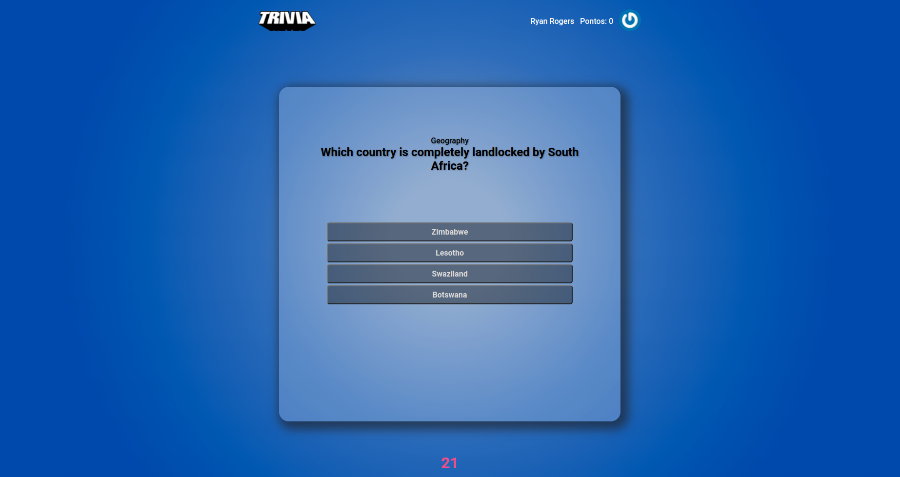
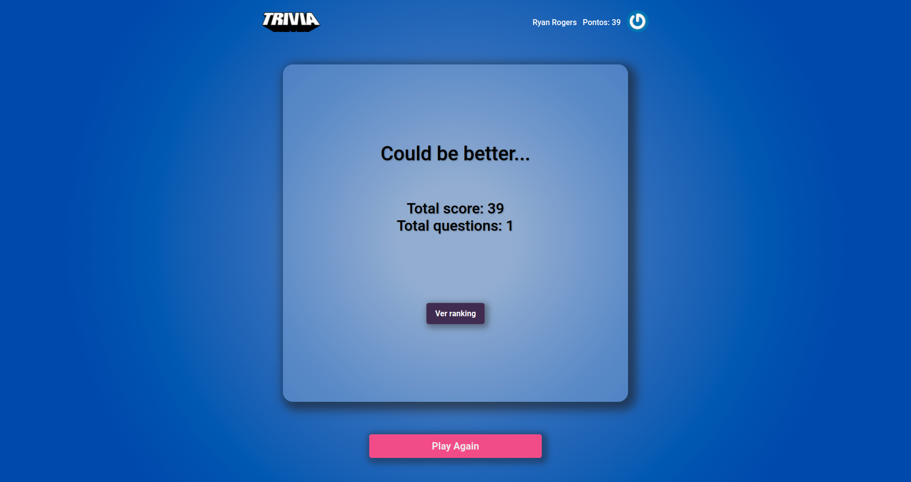
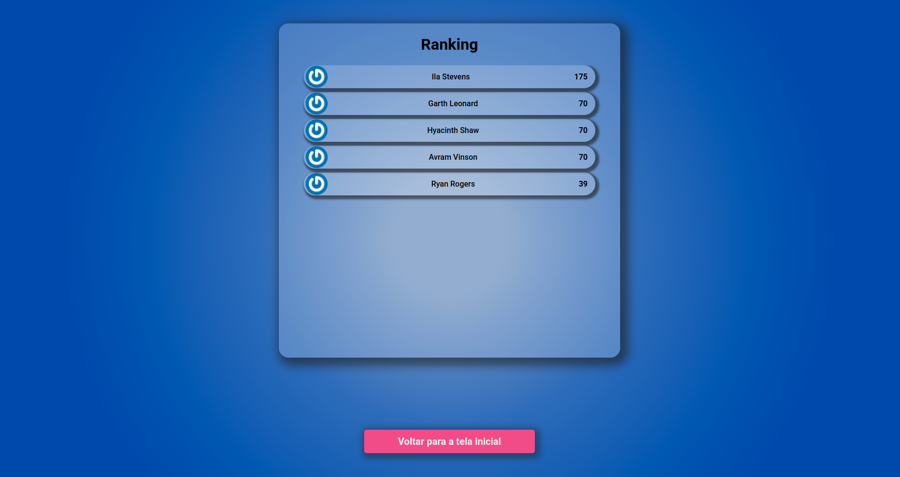
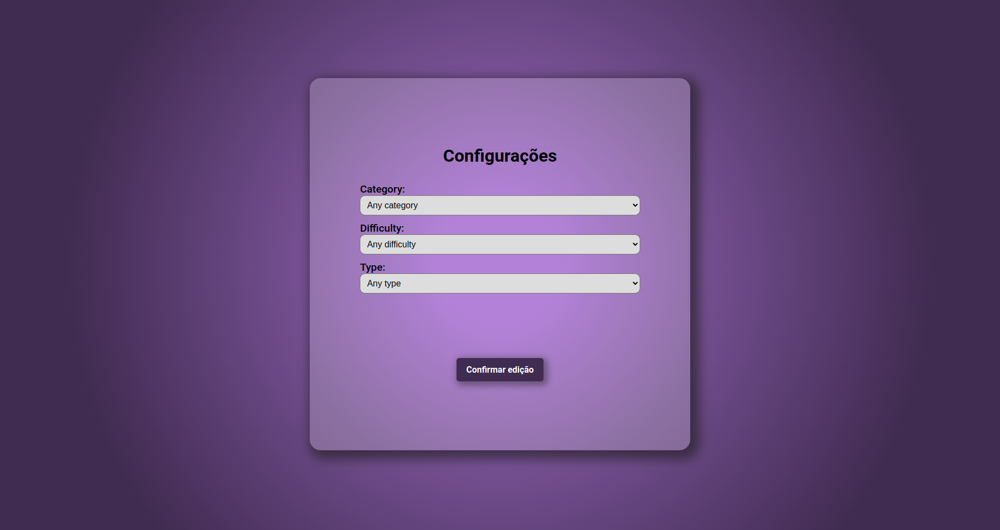

# Projeto Trivia React Redux

Desenvolvi um jogo Trivia com um grupo de 5 pessoas, utilizamos React e Redux. O principal ponto destacado no feedback da Trybe nesse projeto foram os testes que eu criei para a tela de configuração, onde tive que pesquisar um pouco sobre o cypress para montá-los.

# Habilidades

Nesse projeto, testamos as habilidades de:

  - Criar um store Redux em aplicações React

  - Criar reducers no Redux em aplicações React

  - Criar actions no Redux em aplicações React

  - Criar dispatchers no Redux em aplicações React

  - Conectar Redux aos componentes React

  - Criar actions assíncronas na sua aplicação React que faz uso de Redux.

---

## Antes de começar a desenvolver
1. Clone o repositório

- `git clone git@github.com:GeovaniMoura/projeto-trivia-react-redux.git`

2. Entre na pasta do projeto

- `cd projeto-trivia-react-redux`

3. Instale as dependências e inicialize o projeto

- Instale as dependências:
  - `npm install`
- Inicialize o projeto:
  - `npm start` (uma nova página deve abrir no seu navegador com um texto simples)

4. Verifique a sua branch

- Verifique se está na branch `main`, digite:
 - `git branch`
- Caso não esteja, digite:
 - `git checkout main`

5. Crie a sua branch

- `git checkout -b "nome-da-sua-branch"`

## Linter

Utilizei o linter ESLint da Trybe para desenvolver meu projeto, para rodar o linter no projeto, digite:

```bash
npm run lint
npm run lint:styles
```

---

### Execução de testes

Criei os testes para a tela de configurações usando o cypress, para rodar no projeto, digite:

 - npm run cy:open

---

### Documentação da API de Trivia

Se desejar mais informações sobre a API, acesse sua [documentação](https://opentdb.com/api_config.php).

---

### Documentação da API Gravatar

Se desejar mais informações sobre a API, acesse sua [documentação](https://br.gravatar.com/site/implement/images/).

---

### Documentação da CryptoJs

Se desejar mais informações sobre a API, acesse sua [documentação](https://github.com/brix/crypto-js).

---

### Tela de início/login


### Tela de jogo



### Tela de feedback



### Tela de ranking



### Tela de configurações



---